# Raport literówek i błędów językowych — ak1944.vercel.app

Data sprawdzenia: 2026-05-11  
---

## Znalezione błędy

### 1. `/historia` — Podwójne „nie" w zdaniu

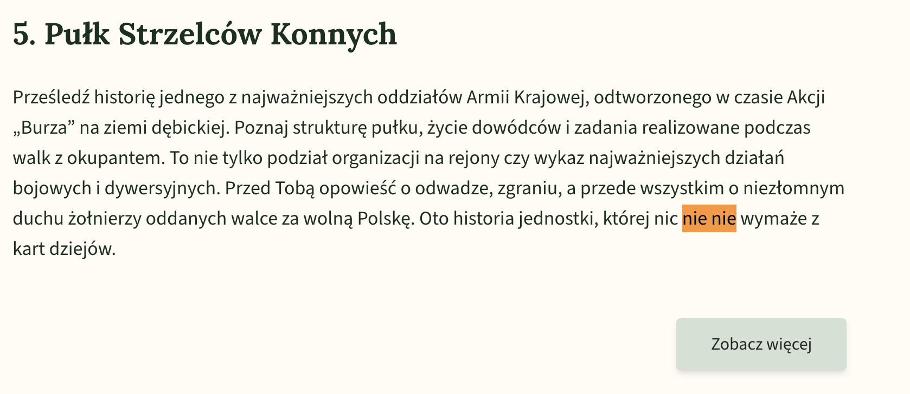

| Błąd | Powinno być |
|------|-------------|
| nic nie **nie** wymaże z kart dziejów | nic nie wymaże z kart dziejów |

---

### 2. `/historia/strzelcy` — 5. Pułk Strzelców Konnych

| Błąd | Powinno być |
|------|-------------|
| w osłabienu realizować działania | w **osłabieniu** realizować działania |
| 3. Dywizjonu **Aryterii** Konnej | 3. Dywizjonu **Artylerii** Konnej |
| Kolejny **odddział** skierowany | Kolejny **oddział** skierowany |
| **spodowowało** duże straty | **spowodowało** duże straty` |
| Pod **niebecność** dowódcy | Pod **nieobecność** dowódcy` |

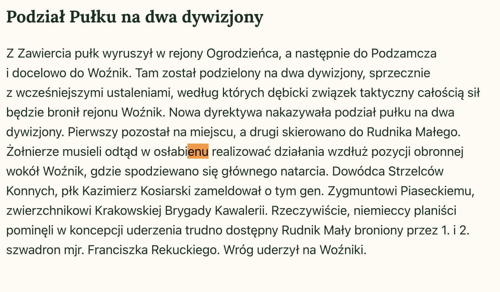
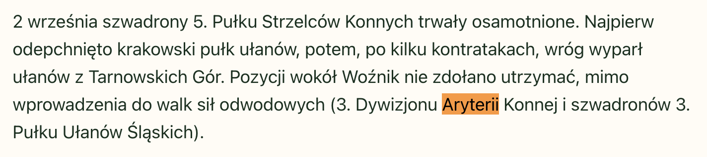
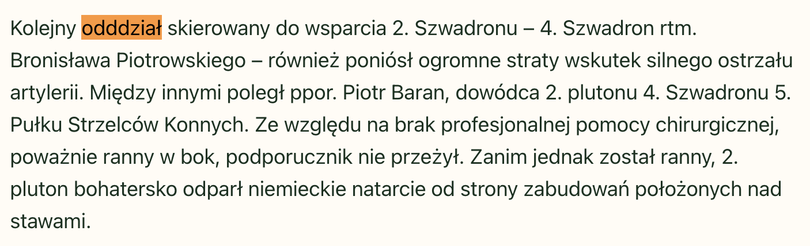
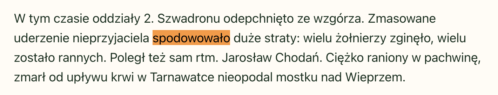
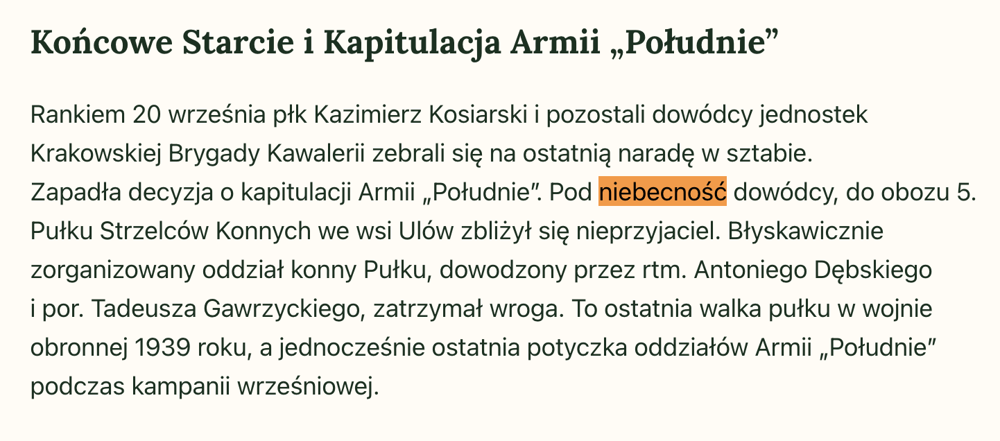

---

### 3. `/historia/obwod-debica` — Obwód Dębica SZP-ZWZ-AK

| Błąd | Powinno być |
|------|-------------|
| **Obwod** SZP - ZWZ - AK Dębica | **Obwód** SZP-ZWZ-AK Dębica |
| „Zapalnik", Zawilec", „66"` | „Zapalnik", **„**Zawilec", „66" — brakuje otwierającego cudzysłowu przed „Zawilec" |

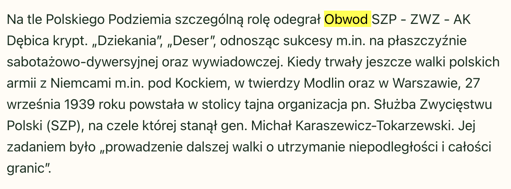
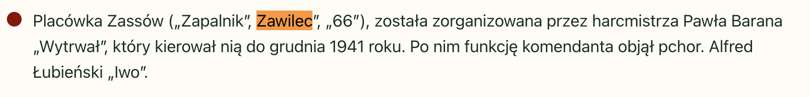

---

### 4. `/historia/akcja-burza` — Akcja „Burza"

| Błąd | Powinno być |
|------|-------------|
| w bliskim **sąsiedzkie** drogi Niedźwiada - Mała |  w bliskim **sąsiedztwie** drogi Niedźwiada – Mała |
| z **kompani** „Pęka"` | z **kompanii** „Pęka" |

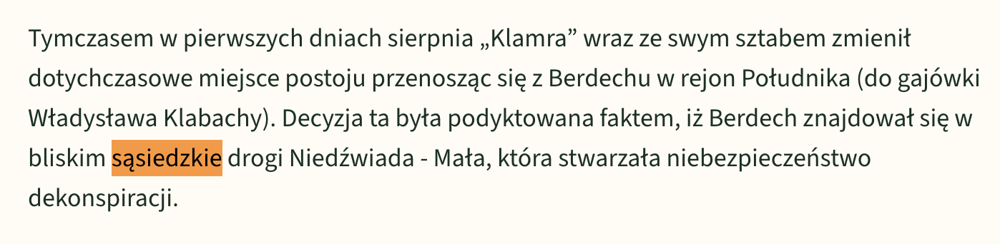
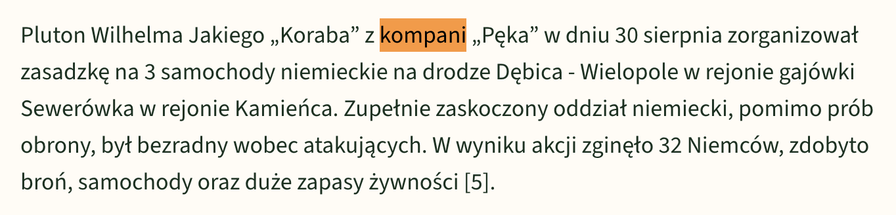

---

### 5. `/regulamin` — Regulamin serwisu

| Błąd | Powinno być |
|------|-------------|
| pozasądowych sposobów rozpatrywania sporów (np. mediacja, **arbitra**) | (np. mediacja, **arbitraż**) |

---
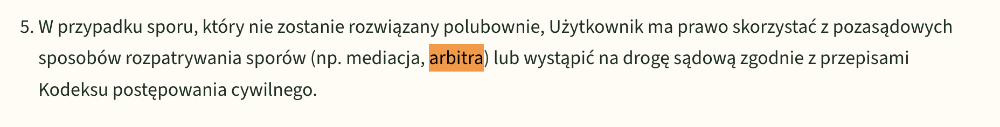

