# Raport błędów UAT — ak1944.vercel.app

Data testowania: 2026-05-11  
Urządzenie: (412×915, mobile Chrome), iPhone (Safari, Chrome)
Środowisko: https://ak1944.vercel.app/

---

## Znalezione błędy

### 1. `/` — Kafelek kalendarza na stronie głównej wyświetla błędną datę

| Pole | Wartość wyświetlona | Oczekiwana wartość |
|------|--------------------|--------------------|
| Dzień | `4` | `11` |
| Imieniny | `Florian, Monika, Damian` | imieniny z dnia 11 maja |

Kafelek kalendarza w sekcji Aktualności wyświetla datę **4 maja** (poniedziałek) zamiast bieżącej daty **11 maja 2026**. Ten sam błąd na środowisku produkcyjnym https://ak1944.pl/ tyle że tam kalendarz pokazuje 5 maja.

### 2. `/strona-ktora-nie-istnieje` — Brak własnej strony 404

| Aktualny stan | Oczekiwany stan |
|---------------|-----------------|
| Domyślna strona Next.js — biała, po angielsku: „This page could not be found." | Brandowana strona 404 z nagłówkiem, nawigacją i linkiem powrotu |
| | |

---
### 3. `/partnerzy`, `/wesprzyj` - brak paddingu ikona serca/dłoni przylega bezpośrednio do stopki 

| Aktualny stan | Oczekiwany stan |
|---------------|-----------------|
| Ikona serca z dłoni przylega bezpośrednio do stopki | Jest odstęp jak na figmie |
|  |  |

---
### 4. `/historia` timeline 
Inna kolejność timeline w figma i na stronie
 

---
### ~~5. `/szlak-partyzancki/rajdy/zapisz-sie-na-rajd` błąd 404~~ Działa na prodzie https://ak1944.pl/

~~Po uzupełnieniu formularza zapisu na rajd dostaje 404~~
 

---
### ~~6. `/wolontariusze/zostan-wolontariuszem` błąd 404~~ Działa na prodzie https://ak1944.pl/

 

----

# Data testowania: 2026-05-15  
Aplikacja do testów na urządzeniach mobilnych: https://responsively.app/
Wybrane urządzenia:
- Galaxy Fold 280x653
- Galaxy Z Fold 4 344x882
- Galaxy S22 360x800
- iPhone SE 375x667
- Galaxy S20 Plus 384x854
- iPhone 12 Pro 390x844
- Xiaomi 14 412x915
- iPhone 13 Pro Max 428x926
- Pixel 8 Pro 430x932

---
## 7. line-height w nagłówkach 
Na wszystkich rozdzielczościach mobilnych tytuł strony/sekcji, gdy łamie się na wiele linii, ma zbyt mały line-height - wiersze wyglądają na sklejone.

### Miejsca pamięci `https://ak1944.vercel.app/zwiazek/miejsca-pamieci/pomnik-upamietniajacy-pchor-mariana-chmielewskiego-ps-maria`

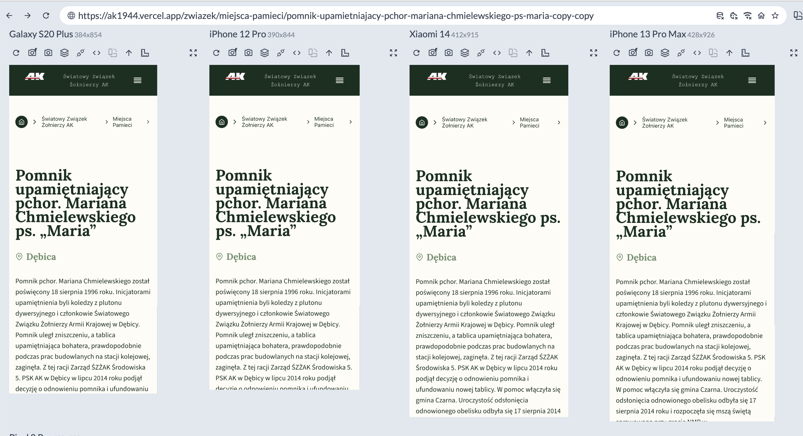

### Geneza `https://ak1944.vercel.app/szlak-partyzancki/geneza`

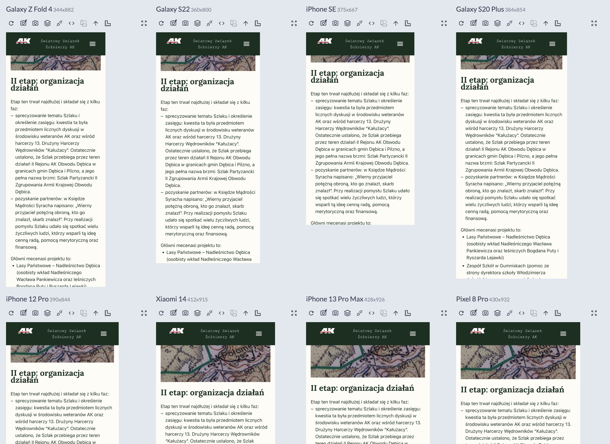
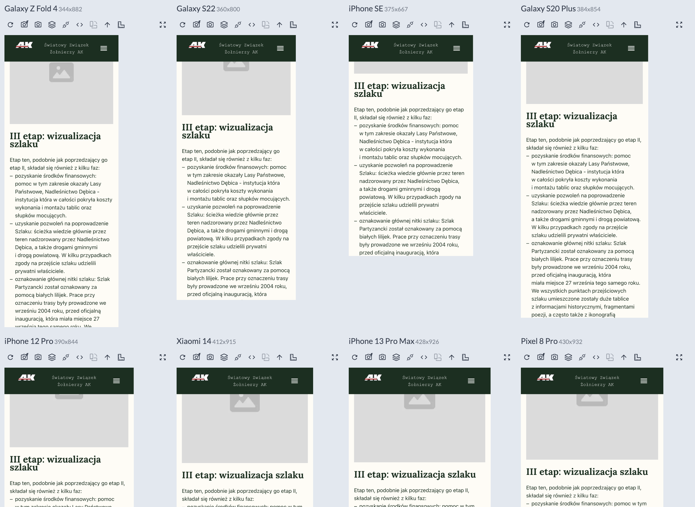
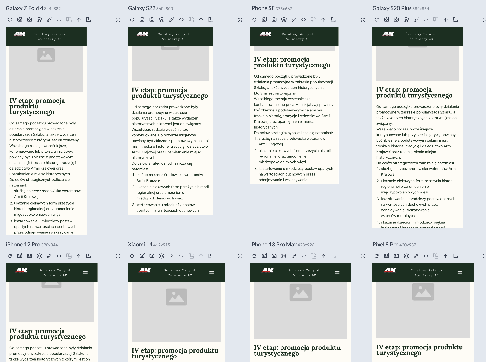

### Wolontariusze `https://ak1944.vercel.app/wolontariusze`

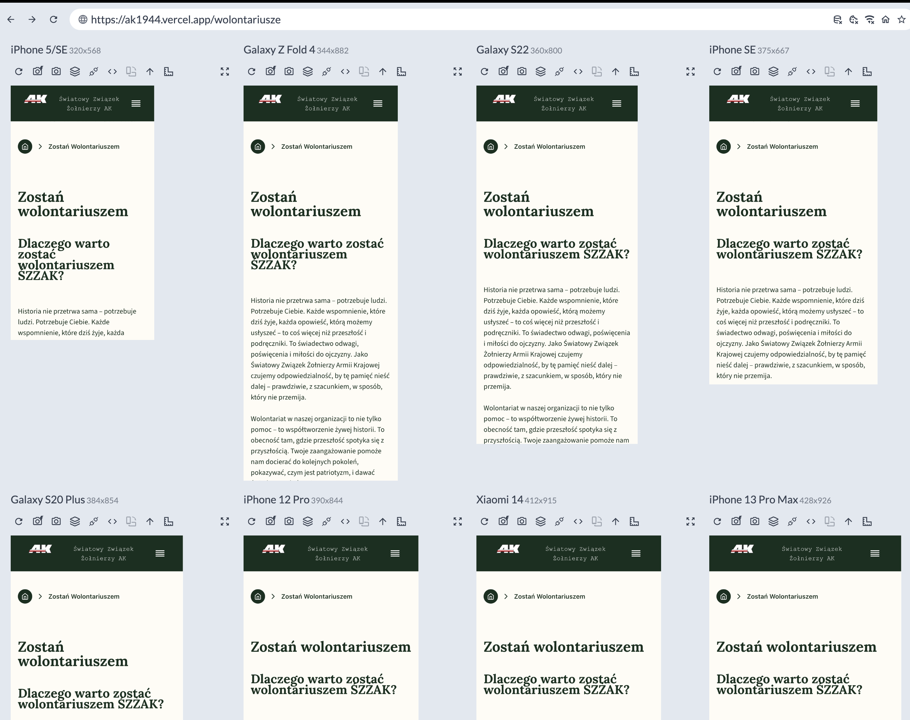
---

## 8. Treść strony /partnerzy przycięta dla szerokości ≤360px
`https://ak1944.vercel.app/partnerzy`

Treść jest przycinana po obu stronach ekranu — brakuje paddingu/marginesu po lewej i prawej stronie kontenera. 
Problem nie występuje od 360px wzwyż.

Z pierwszego spotkania mam zapisane że minimalna wspierana to 320px

Widok do odtworzenia: iPhone 5/SE 320x568px w Responsively App / Chrome DevTools

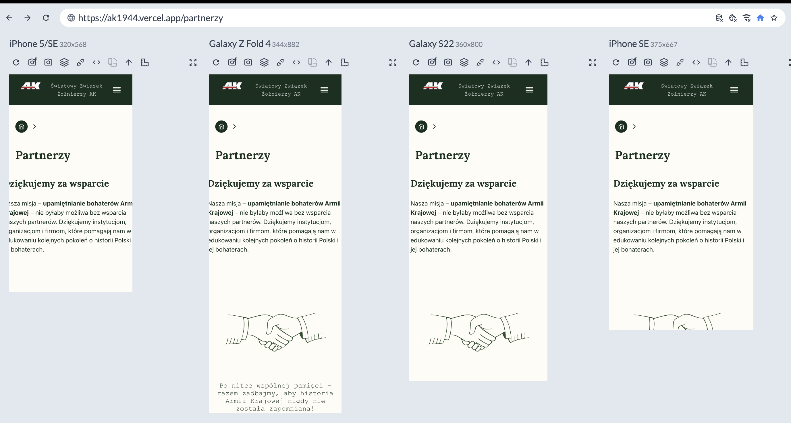

---

## 9. Kontrast - Grafika zostań wolontariuszem zły kolor
https://ak1944.vercel.app/wesprzyj
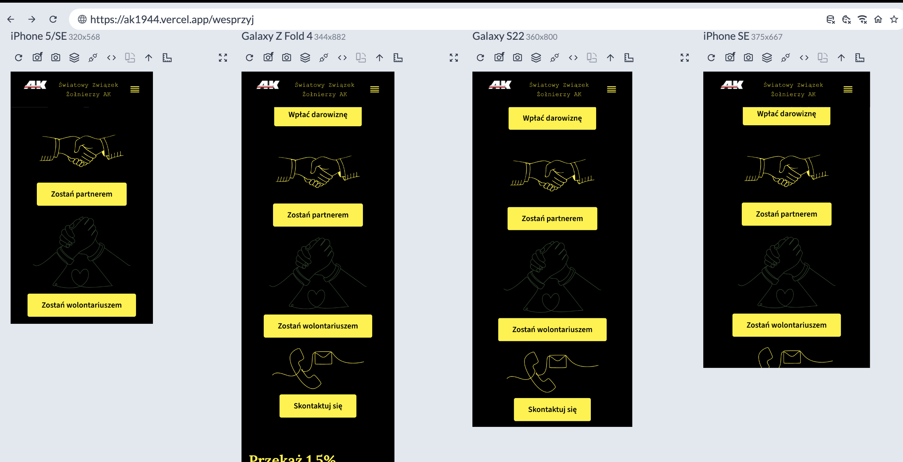

https://ak1944.vercel.app/wolontariusze
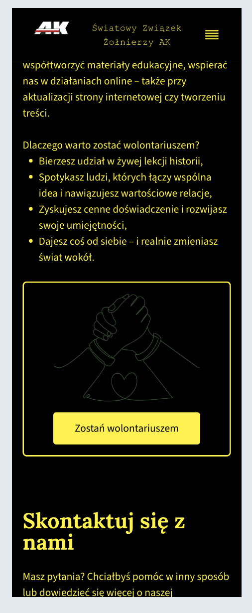

---

## 10. Blockquote — niespójny układ komponentu (dwa różne warianty renderowania na mobile)

| Wpis z archiwum | Geneza |
|---------------|-----------------|
| 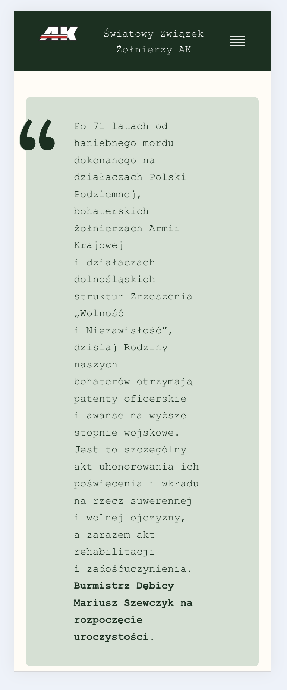 | 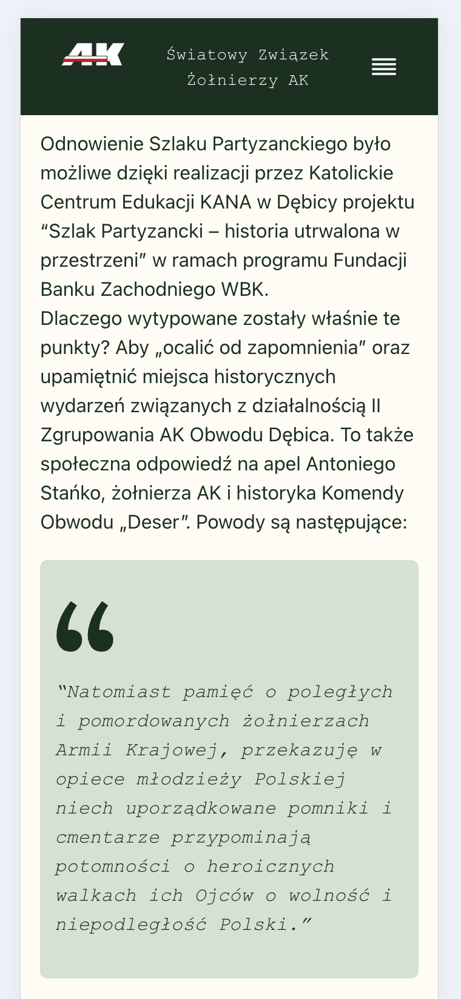 |

---

## 11. Pagination dots — inactive dot niewidoczny w trybie wysokiego kontrastu

| Normal | Kontrast |
|---------------|-----------------|
| 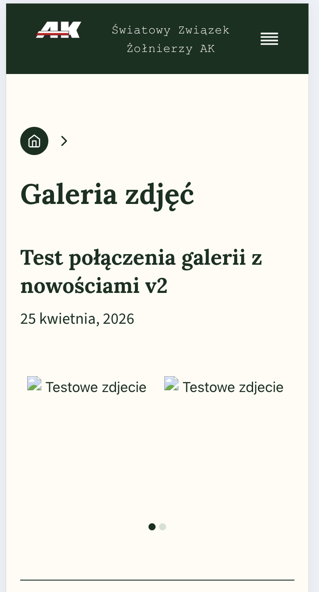 | 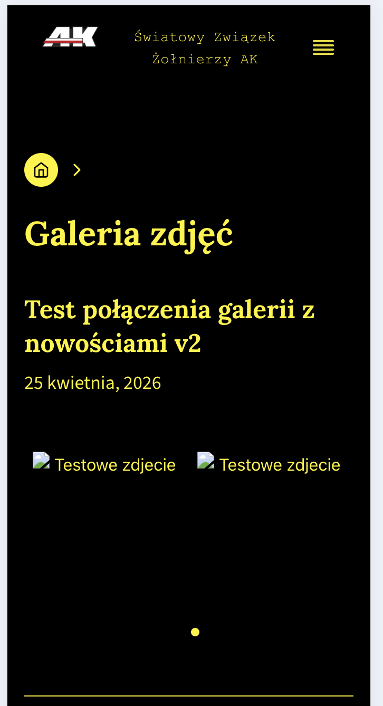 |

