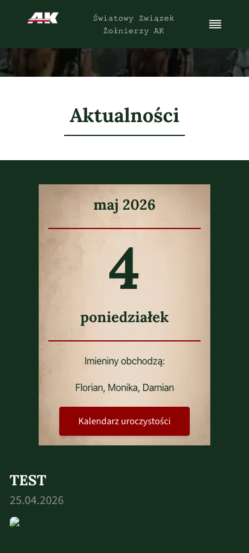
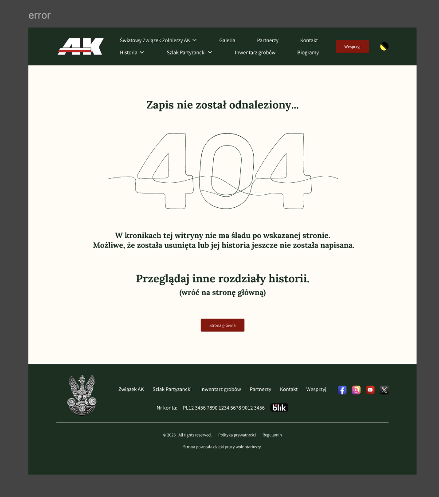
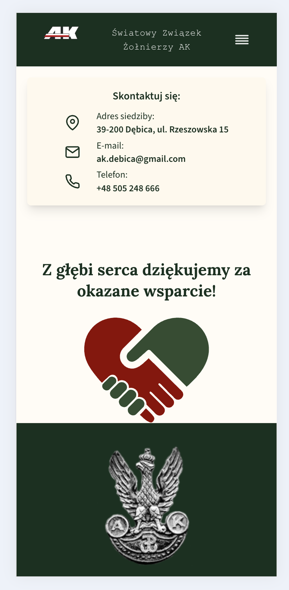
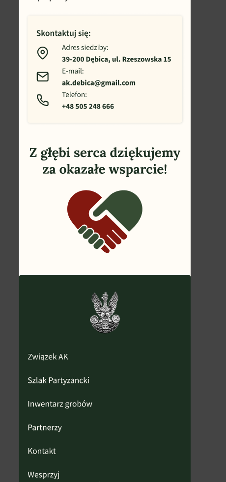
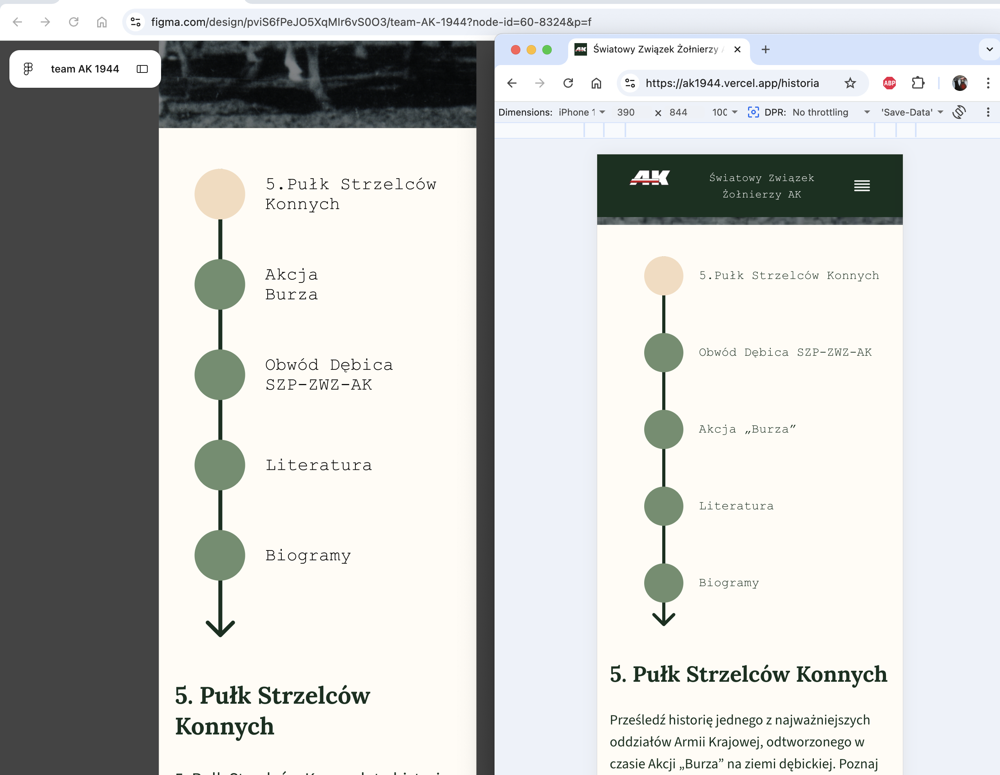
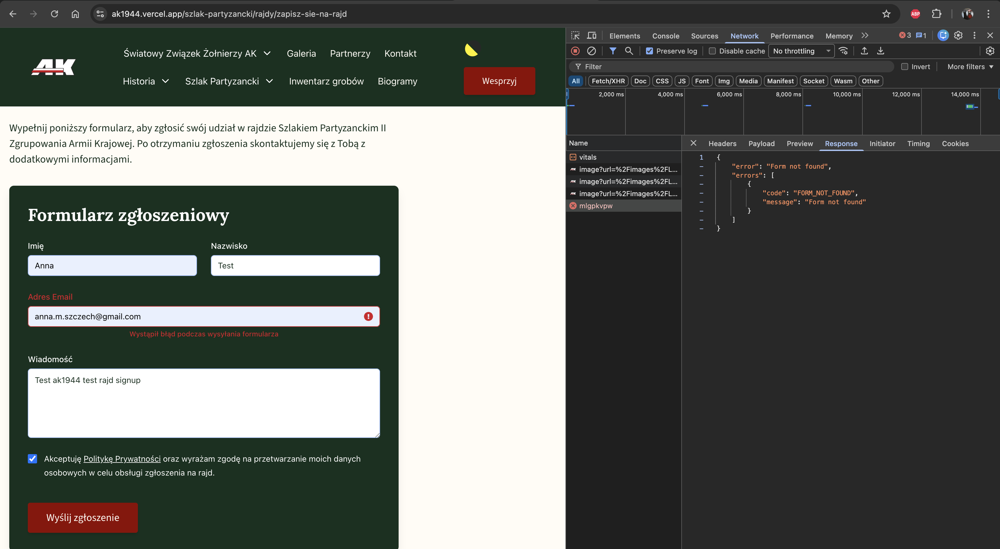
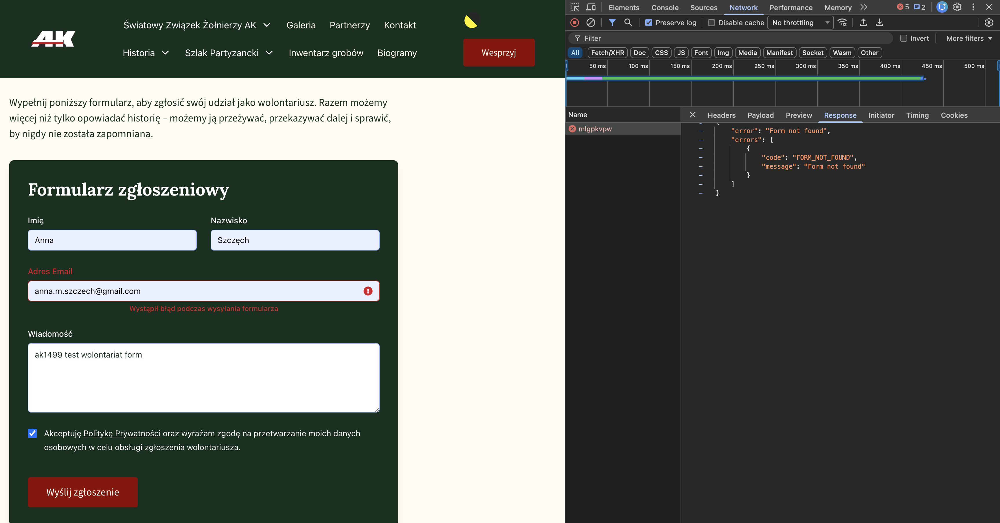

# Raport błędów UAT — ak1944.vercel.app

Data testowania: 2026-05-11  
Urządzenie: (412×915, mobile Chrome), iPhone (Safari, Chrome)
Środowisko: https://ak1944.vercel.app/

---

## Znalezione błędy

### 1. `/` — Kafelek kalendarza na stronie głównej wyświetla błędną datę

| Pole | Wartość wyświetlona | Oczekiwana wartość |
|------|--------------------|--------------------|
| Dzień | `4` | `11` |
| Imieniny | `Florian, Monika, Damian` | imieniny z dnia 11 maja |

Kafelek kalendarza w sekcji Aktualności wyświetla datę **4 maja** (poniedziałek) zamiast bieżącej daty **11 maja 2026**. Ten sam błąd na środowisku produkcyjnym https://ak1944.pl/ tyle że tam kalendarz pokazuje 5 maja.

### 2. `/strona-ktora-nie-istnieje` — Brak własnej strony 404

| Aktualny stan | Oczekiwany stan |
|---------------|-----------------|
| Domyślna strona Next.js — biała, po angielsku: „This page could not be found." | Brandowana strona 404 z nagłówkiem, nawigacją i linkiem powrotu |
| | |

---
### 3. `/partnerzy`, `/wesprzyj` - brak paddingu ikona serca/dłoni przylega bezpośrednio do stopki 

| Aktualny stan | Oczekiwany stan |
|---------------|-----------------|
| Ikona serca z dłoni przylega bezpośrednio do stopki | Jest odstęp jak na figmie |
|  |  |

---
### 4. `/historia` timeline 
Inna kolejność timeline w figma i na stronie
 

---
### 5. `/szlak-partyzancki/rajdy/zapisz-sie-na-rajd` błąd 404

Po uzupełnieniu formularza zapisu na rajd dostaje 404
 

---
### 6. `/wolontariusze/zostan-wolontariuszem` błąd 404
 

---
### 7.